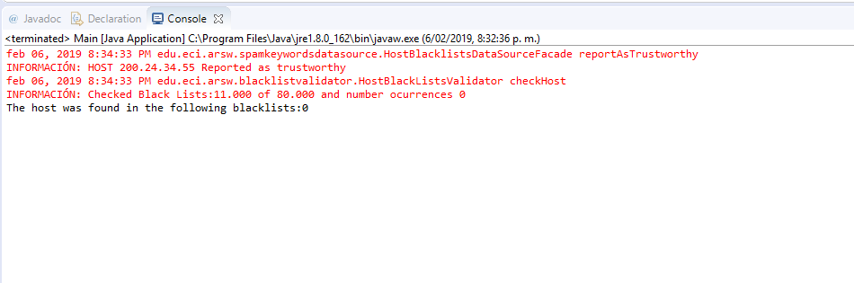
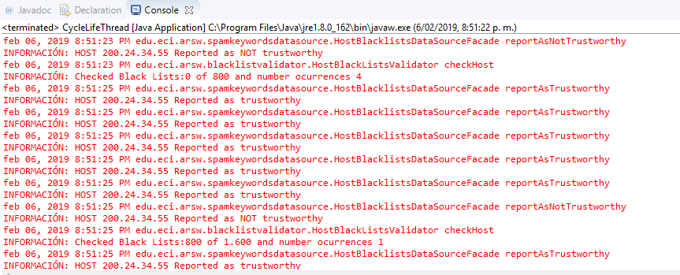
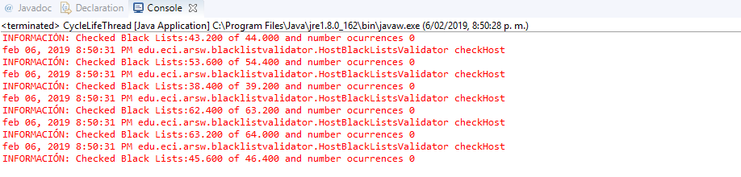
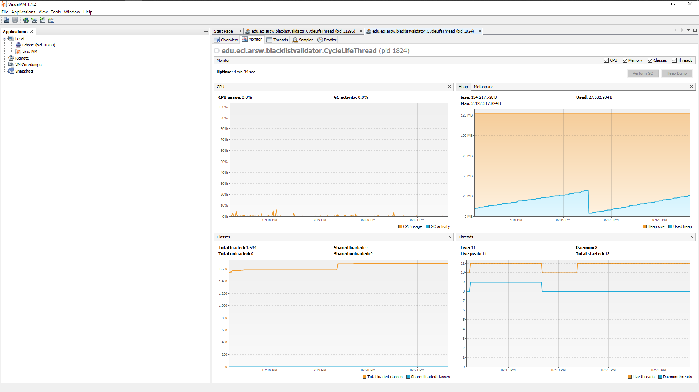
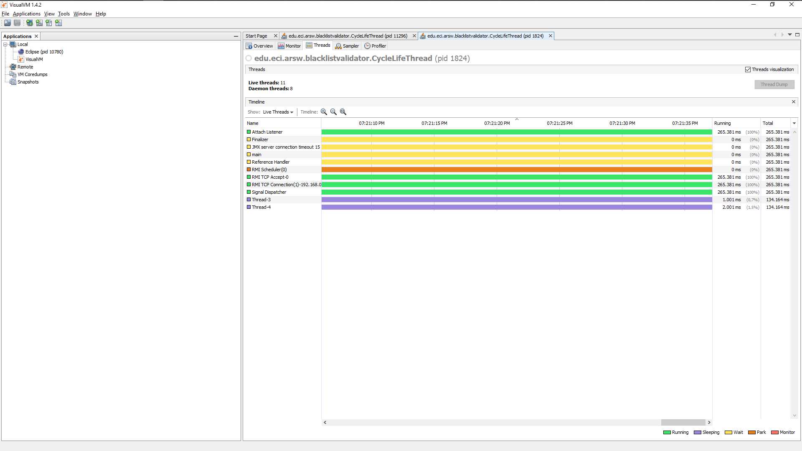
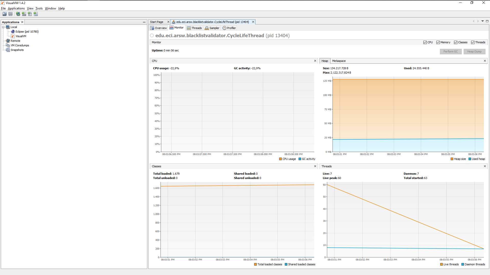
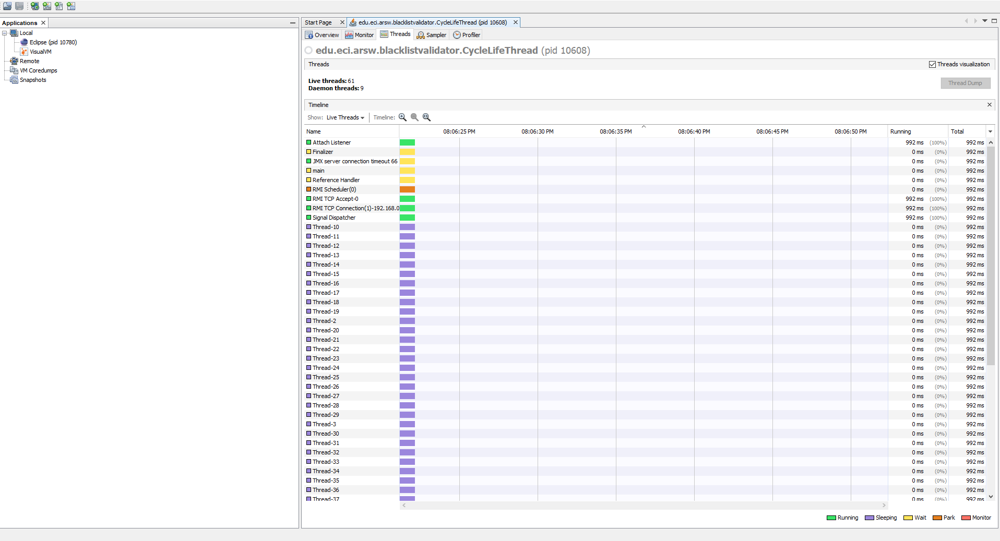
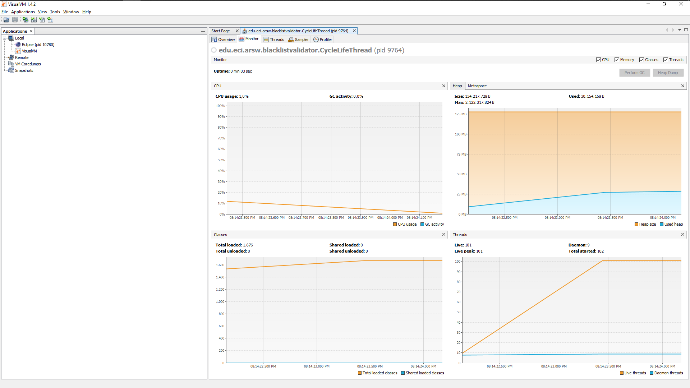
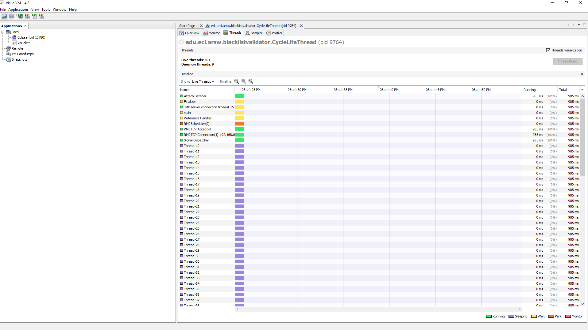

# Laboratorio 3 Introducción Threads


## Empezando

>Para clonar el archivo 

git clone https://github.com/nontoa/ARSW-LAB3.git
>
### Prerrequisitos
* Maven
* Java
* Git
* Threads


### Instalación

Despues de clonar el archivo para correrlo con:

* mvn package "Esto te genera el JAR"

## Construido con

* [Maven](https://maven.apache.org/) - Gestión de dependencias

## Parte Black List Search

### Part I - Introduction to threads in JAVA
#### 1) Corriendo con un solo Thread

```java
package edu.eci.arsw.threads;

import java.util.*;
import java.io.*;
public class CountThreads extends Thread {
    public int A,B;
    public CountThreads(int A,int B){
        this.A=A;
        this.B=B;
    }

    @Override
    public void run() {
        super.run();
        for(int i=this.A;i<=this.B;i++){
            System.out.println(i+"Corriendo por "+Thread.currentThread().toString());
        }
    }

}

```
#### Main
```java
import edu.eci.arsw.threads.CountThreads;
public class CountThreadsMain {
    
    public static void main(String args[]){
        CountThreads th1 = new CountThreads(0,99);
        //Run Threads
        th1.start();
    }

}


```

        0 Count Corriendo por Thread[Thread-0,5,main]
        1 Count Corriendo por Thread[Thread-0,5,main]
        2 Count Corriendo por Thread[Thread-0,5,main]
        3 Count Corriendo por Thread[Thread-0,5,main]
        4 Count Corriendo por Thread[Thread-0,5,main]
        5 Count Corriendo por Thread[Thread-0,5,main]
        6 Count Corriendo por Thread[Thread-0,5,main]
        7 Count Corriendo por Thread[Thread-0,5,main]
        8 Count Corriendo por Thread[Thread-0,5,main]
        9 Count Corriendo por Thread[Thread-0,5,main]
        10 Count Corriendo por Thread[Thread-0,5,main]
        11 Count Corriendo por Thread[Thread-0,5,main]
        12 Count Corriendo por Thread[Thread-0,5,main]
        13 Count Corriendo por Thread[Thread-0,5,main]
        14 Count Corriendo por Thread[Thread-0,5,main]

#### 2) Corriendo con tres Threads
```java
package edu.eci.arsw.threads;

/**
 *
 * @author hcadavid
 */
import edu.eci.arsw.threads.CountThreads;
public class CountThreadsMain {
    
    public static void main(String args[]){
        CountThreads th1 = new CountThreads(0,99);
        CountThreads th2 = new CountThreads(99,199);
        CountThreads th3 = new CountThreads(200,299);
        
        //Run Threads
        th1.start();
        th2.start();
        th3.start();

    }

}

```
### Screen para tres Threads con start()

    0 Corriendo por Thread[Thread-0,5,main]
    200 Corriendo por Thread[Thread-2,5,main]
    1 Corriendo por Thread[Thread-0,5,main]
    201 Corriendo por Thread[Thread-2,5,main]
    2 Corriendo por Thread[Thread-0,5,main]
    99 Corriendo por Thread[Thread-1,5,main]
    202 Corriendo por Thread[Thread-2,5,main]
    100 Corriendo por Thread[Thread-1,5,main]
    3 Corriendo por Thread[Thread-0,5,main]
    101 Corriendo por Thread[Thread-1,5,main]
    203 Corriendo por Thread[Thread-2,5,main]
    102 Corriendo por Thread[Thread-1,5,main]
    103 Corriendo por Thread[Thread-1,5,main]
    104 Corriendo por Thread[Thread-1,5,main]
    105 Corriendo por Thread[Thread-1,5,main]

> Nota: Se ve como se alternan los hilos a esto se le denomina interleaving


### Screen para tres Threads con run()

```java
    package edu.eci.arsw.threads;

/**
 *
 * @author hcadavid
 */
import edu.eci.arsw.threads.CountThreads;
public class CountThreadsMain {
    
    public static void main(String args[]){
        CountThreads th1 = new CountThreads(0,5);
        CountThreads th2 = new CountThreads(5,10);
        CountThreads th3 = new CountThreads(10,15);
        
        //Run Threads
        th1.run();
        th2.run();
        th3.run();

    }

}

```
    0 Corriendo por Thread[main,5,main]
    1 Corriendo por Thread[main,5,main]
    2 Corriendo por Thread[main,5,main]
    3 Corriendo por Thread[main,5,main]
    4 Corriendo por Thread[main,5,main]
    5 Corriendo por Thread[main,5,main]
    5 Corriendo por Thread[main,5,main]
    6 Corriendo por Thread[main,5,main]
    7 Corriendo por Thread[main,5,main]
    8 Corriendo por Thread[main,5,main]
    9 Corriendo por Thread[main,5,main]
    10 Corriendo por Thread[main,5,main]
    10 Corriendo por Thread[main,5,main]
    11 Corriendo por Thread[main,5,main]
    12 Corriendo por Thread[main,5,main]

> Nota: En este caso lo cada instancia se ejecuta secuencialmente es decir run() solo ejecuta el metodo y start() prepara el hilo lo cual permite la concurrencia 

### Part II - Black List Search Exercise

Numero de Servidores Maliciosos encontrados para el servidor con ip 200.24.34.55 fueron 5 corriendolo desde el Main se encuentra en el rango de [0-10000]

```java
/*
 * To change this license header, choose License Headers in Project Properties.
 * To change this template file, choose Tools | Templates
 * and open the template in the editor.
 */
package edu.eci.arsw.blacklistvalidator;

import java.util.List;


public class Main {
    
    public static void main(String a[]){
        HostBlackListsValidator hblv=new HostBlackListsValidator(0,80000);
        int blackListOcurrences=hblv.checkHost("200.24.34.55",N);
        System.out.println("The host was found in the following blacklists:"+blackListOcurrences);
        
    }
    
}


```




### Ejecutando checkHost con parametro N
```java
package edu.eci.arsw.blacklistvalidator;

import java.nio.channels.ShutdownChannelGroupException;
import java.util.ArrayList;
import java.util.List;

public class CycleLifeThread extends Thread {
	public static ArrayList<CycleLifeThread> ll;
	public static ArrayList<HostBlackListsValidator> ll2;
	public static ArrayList<Integer> X;
	public static int answer = 0;
	public static int cnt = -1;
	public static int flag = 0;
	static int M = 100;
	static int N = 80000;

	public static void main(String[] args) {
		ArrayList<CycleLifeThread> ll = new ArrayList();
		ArrayList<HostBlackListsValidator> ll2 = new ArrayList();
		X = new ArrayList();
		ll.add(new CycleLifeThread());
		ll.get(ll.size() - 1).start();
		try {
			ll.get(ll.size() - 1).join();
		} catch (InterruptedException e1) {
			// TODO Auto-generated catch block
			e1.printStackTrace();
		}
		for (int i = 0; i < M + 1; i++) {
			ll.add(new CycleLifeThread());
			ll.get(ll.size() - 1).start();
		}
		for (int i = 0; i < M + 2; i++) {
			try {
				ll.get(ll.size() - 1).join();
			} catch (InterruptedException e) {
				e.printStackTrace();
			}
		}
		for (CycleLifeThread b : ll) {
			if (b.isAlive())
				flag = 1;

		}

		while (flag == 1) {
			break;

		}

		if (flag == 0) {
			int resp = 0;
			for (int a : X)
				resp += a;
			if (resp >= 5) {
				System.out.println("Resported as trustworthy");
			} else {
				System.out.println("Reported as NOT trustworthy");
			}
		}
	}

	public void run() {

		cnt++;
		// X.add(new HostBlackListsValidator((cnt * N) / M, ((cnt + 1) * N /M)).checkHost("200.24.34.55", N));
		X.add(new HostBlackListsValidator((cnt * N) / M, ((cnt + 1) * N / M)).checkHost("212.24.24.55", N));
	}

}


```

```java
package edu.eci.arsw.blacklistvalidator;

import edu.eci.arsw.spamkeywordsdatasource.HostBlacklistsDataSourceFacade;
import java.util.LinkedList;
import java.util.List;
import java.util.logging.Level;
import java.util.logging.Logger;

/**
 *
 * @author hcadavid
 */
public class HostBlackListsValidator {
    int A;
    int B;
    private static final int BLACK_LIST_ALARM_COUNT=1;
    
    /**
     * Check the given host's IP address in all the available black lists,
     * and report it as NOT Trustworthy when such IP was reported in at least
     * BLACK_LIST_ALARM_COUNT lists, or as Trustworthy in any other case.
     * The search is not exhaustive: When the number of occurrences is equal to
     * BLACK_LIST_ALARM_COUNT, the search is finished, the host reported as
     * NOT Trustworthy, and the list of the five blacklists returned.
     * @param ipaddress suspicious host's IP address.
     * @return  Blacklists numbers where the given host's IP address was found.
     */
    public HostBlackListsValidator(int A,int B) {
	this.A=A;
        this.B=B;
	}
    
    public int checkHost(String ipaddress,int N){
        
        LinkedList<Integer> blackListOcurrences=new LinkedList<>();
        
        int ocurrencesCount=0;
        
        HostBlacklistsDataSourceFacade skds=HostBlacklistsDataSourceFacade.getInstance();
        
        int checkedListsCount=0;
        
        //ocurrencesCount<=BLACK_LIST_ALARM_COUNT
        
        for (int i=A;i<B;i++){
            checkedListsCount++;
            if (skds.isInBlackListServer(i, ipaddress)){
                
                blackListOcurrences.add(i);
                ocurrencesCount++;
            }
        }
        
        if (ocurrencesCount>=BLACK_LIST_ALARM_COUNT){
            skds.reportAsNotTrustworthy(ipaddress);
        }
        else{
            skds.reportAsTrustworthy(ipaddress);
        }                
    
        LOG.log(Level.INFO, "Checked Black Lists:{0} of {1} and number ocurrences {2}", new Object[]{A, B,ocurrencesCount});
        
        return ocurrencesCount;
    }
    private static final Logger LOG = Logger.getLogger(HostBlackListsValidator.class.getName());
}


```

>Ejecución Con la ip "200.24.34.55":



>Ejecución Con la ip "212.24.24.55":




### Part III - Discussion

Se podría mejorar haciendo tantos subprocesos como nucleos de procesamiento haya en el computador que se este trabajando, para esto podemos usar la API runTime. Así se aprovechara al máximo la capacidad de procesamiento y por lo tanto la estrategia sería eficiente.

> Clase RunTime: Cada aplicación Java tiene una única instancia de la clase Runtime que permite a la aplicación interactuar con el entorno en el que se ejecuta la aplicación. El tiempo de ejecución actual se puede obtener del método getRuntime. Una aplicación no puede crear su propia instancia de esta clase.


### Part IV - Performance Evaluation

Gráficas de visualVM con un numero determinado de hilos.

* Para un solo hilo se comporta de la siguiente manera:



* Y el comportamiento del hilo:



* Para 50 hilos se comporta de la siguiente manera:



* Y el comportamiento de los 50 hilos:



* Para 100 hilos se comporta de la siguiente manera:



* Y el comportamiento de los 100 hilos:




>Vemos que para calculos no tan grandes el número exagerado de hilos no puede ser la solución para optimizar el rendimiento. Como observamos anteriormente en las graficas, algunas veces es mejor que la cantidad de subprocesos no sea tan grande, puesto que esto puede generar perdida de tiempo ya que hay muchos procesos corriendo para un objetivo pequeño que se puede solucionar con menos hilos.


## Parte Snake Race

#### Codigo Controlador

```java
/*
 * To change this license header, choose License Headers in Project Properties.
 * To change this template file, choose Tools | Templates
 * and open the template in the editor.
 */
package edu.eci.arsw.primefinder;

/**
 *
 */
import java.util.*;
import java.io.*;

public class Control extends Thread {

	private final static int NTHREADS = 3;
	private final static int MAXVALUE = 30000000;
	public final static int TMILISECONDS = 5000;

	private final int NDATA = MAXVALUE / NTHREADS;

	private PrimeFinderThread pft[];

	private Control() {
		super();

		this.pft = new PrimeFinderThread[NTHREADS];

		int i;
		for (i = 0; i < NTHREADS - 1; i++) {
			PrimeFinderThread elem = new PrimeFinderThread(i * NDATA, (i + 1) * NDATA);
			pft[i] = elem;
		}
		pft[i] = new PrimeFinderThread(i * NDATA, MAXVALUE + 1);
	}

	public static Control newControl() {
		return new Control();
	}

	@Override
	public void run() {
		Scanner sc = new Scanner(System.in);
		for (int i = 0; i < NTHREADS; i++) {
			pft[i].numberThread=i+1;
			pft[i].start();

		}
		
		for(long finaliza = System.currentTimeMillis() + TMILISECONDS;System.currentTimeMillis() <= finaliza;) {
			if (System.currentTimeMillis() >= finaliza && !terminate()) {
				for (int i = 0; i < pft.length; i++) {
					pft[i].detener();

				}
				System.out.println("Touch key");
				sc.nextLine();
				for (int i = 0; i < pft.length; i++) {
					System.out.println("The thread that is running is "+ pft[i].numberThread+" number of primes is: "+pft[i].getPrimes().size());
					pft[i].activar();
				}

				synchronized (this) {
					this.notifyAll();
				}
				finaliza = System.currentTimeMillis() + TMILISECONDS;
			} else if (System.currentTimeMillis() >= finaliza && terminate()) {
				for (int i = 0; i < pft.length; i++)
					System.out.println("The thread " + pft[i].numberThread + " have be found " + pft[i].getPrimes().size());
				System.out.println("Finish");
				System.exit(0);
			}
		}

	}
	private boolean terminate() {
    	boolean acabar = true;
    	for (int i = 0; i < pft.length && acabar; i++) {
			if(pft[i].isAlive()) acabar = false;
		}
    	return acabar;
    }

}
```

#### Codigo del Main
```java
package edu.eci.arsw.primefinder;

import java.util.*;
import java.io.*;

public class Main {

	public static void main(String[] args) {
		Control control = Control.newControl();
		Scanner sc = new Scanner(System.in);
		control.start();

	}

}
```

#### Codigo para Calculos de Primos
```java
package edu.eci.arsw.primefinder;

import java.util.LinkedList;
import java.util.List;
import java.util.Scanner;

public class PrimeFinderThread extends Thread {

	int a, b;

	private List<Integer> primes;
	public boolean espere = false;
	public int numberThread;

	public PrimeFinderThread(int a, int b) {
		super();
		this.primes = new LinkedList<>();
		this.a = a;
		this.b = b;
	}

	@Override
	public void run() {
		Scanner sc = new Scanner(System.in);

		for (int i = a; i < b; i++) {
			if (espere) {
				synchronized (this) {

					try {
						
						this.wait();
					} catch (InterruptedException e) {
						// TODO Auto-generated catch block
						e.printStackTrace();
					}

				}
			}
			if (isPrime(i)) {
				primes.add(i);
				// System.out.println(i);
			}

		}
	}

	boolean isPrime(int n) {
		boolean ans;
		if (n > 2) {
			ans = n % 2 != 0;
			for (int i = 3; ans && i * i <= n; i += 2) {
				ans = n % i != 0;
			}
		} else {
			ans = n == 2;
		}
		return ans;
	}
	
	
	public List<Integer> getPrimes() {
		return primes;
	}

	public void detener() {

		espere = true;

	}

	public synchronized void activar() {

		espere = false;
		this.notifyAll();

	}
}
```


## Autores

* **Andres Giovanne Florez Perez**  ARSW-LAB3 - [andresflorezp] (https://github.com/andresflorezp)

* **Juan Nicolas Nontoa Caballero**  ARSW-LAB3 - [nontoa] (https://github.com/nontoa)

Consulte también la lista de [colaboradores] (https://github.com/nontoa/ARSW-LAB3/graphs/contributors) que participaron en este proyecto.

## licencia

Este proyecto está licenciado bajo la Licencia MIT - vea el archivo [LICENSE](LICENSE) para más detalles.

